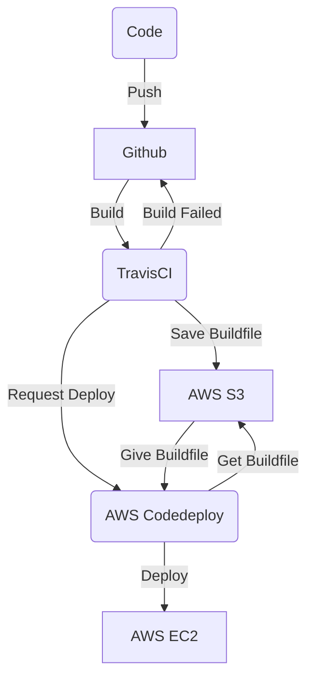

layout: post
title: 스타트업에서 CI/CD 무중단 배포 환경 구성하기 
subtitle: 개발자 김용수
tags: [devlog], [김용수]

## 해결해야 할 첫번째 문제

[Bizcowork Devlog를 시작하며](https://bizcoworkdev.github.io/2020-12-07-Bizcowork-Devlog%EB%A5%BC-%EC%8B%9C%EC%9E%91%ED%95%98%EB%A9%B0/)

지난 글에서 언급했던 해결해야할 문제 중 첫번째로 선택한 것은 배포, 빌드 환경의 구축입니다. 

아무래도 인프라 구성과 직접적 관련이 있기 때문에 프로젝트가 어느 정도 진행된 이후에 변경하려고 한다면 불어난 몸집만큼 움직이기 힘들 것으로 판단했기 때문입니다. 

첫 번째 문제 풀이에 들어가기 전에 하나 고백할 것이 있다면, 저는 부끄럽게도 자동화된 배포 환경을 구축해본 적도, 사용해 본 적도 없습니다. 전 직장에서는 그저 로컬에서 동작시킨 코드들을 압축해서 서버에 FTP로 바로 업로드하여 배포하고 잘되길 기도했을 뿐이었기에, 인프라 관련 지식이 전무합니다. ~~그리하여 이 글을 따라 환경을 구성하는 경우 모든 책임은 본인에게 있으며 Bizcowork은 이를 책임지지 않습니다.~~

---


## 고려해야 할 것

문제는 선택했으니, 어떤 방향으로 접근할지를 고민해봤습니다. 이제 막 개발에 들어간 플랫폼이니 유연하고 확장이 자유롭게 만들고 싶었고, 동시에 현재 회사의 규모에 맞게 비용을 최대한 절감하고 싶었습니다.

문제는 확장성과 비용 절감을 동시에 만족하기가 어려웠다는 점입니다. 배포와 확장을 용이하게 하기 위해 서비스를 최대한 나누고 싶었는데, 그렇다면 필연적으로 컨테이너가 늘어나게 되고, 이를 관리하기 위해서 쿠버네티스를 도입한다면 배보다 배꼽이 더 큰 상황이 되어버릴 겁니다. 아무리 확장성을 생각한다고 해도 매달 불필요한 지출이 생기는 것은 기분 좋은 일이 아닙니다.

쿠버네티스에서 눈을 돌려서 ECS로 눈을 돌려 최대한 작은 규모로 구성한다고 해도, 컨테이너 하나당 하나의 Fargate 서비스가 필요하다던가, 최소 m5zn.large의 EC2 인스턴스가 필요했습니다. 저는 이보다 짠 내 나는 구성을 원했습니다.

---


## 작고 소중한 CI/CD 구성

그리하여 생각해낸 기본적인 아이디어는 아주 작은 EC2 위에 서비스를 전부 몰아넣고 이를 Docker로 분리해두는 겁니다. 그렇다면 언제든 ECS로 다시 구성을 해야 할 때 비용이 적게 들 겁니다. 그리고 이를 하나의 Docker compose 설정으로 관리하고, 배포를 할 때는 각자의 서비스 컨테이너만 업데이트해 준다는 컨셉으로 구성했습니다.



위와 같은 Flow로 배포는 진행되며 간단히 설명하자면, Code를 푸시하면 Github에서 Travis CI로 빌드를 요청하고 빌드 성공시 빌드 파일을 스토리지인 S3에 업로드, 그 후에 AWS의 배포 서비스인 Codedeploy에 배포 요청을 합니다. Codedeploy에서는 빌드파일을 S3에서 가져와 EC2에 정해진 배포그룹에 맞춰 서비스를 배포합니다.

```

.
│   docker-compose.yml
└───deploy
│   └───hancup-backend
│   └───hancup-frontend
└───webserver

```

위와 같이 디렉토리를 구성하였고, 배포는 deploy 디렉토리 내에 서비스별로 나누어서 이루어지게됩니다. 

다음은 docker-compose 설정입니다.

```
version: '3'

services:
  hancup-backend:
    build:
      context: ./deploy/hancup-backend
    volumes:
      - ./deploy/hancup-backend:/backend
    ports:
      - "8000:8000"
  hancup-frontend:
    build:
      context: ./deploy/hancup-frontend
    volumes:
      - ./deploy/hancup-frontend:/frontend
      - "/frontend/node_modules"
    ports:
      - "3000:3000"
  nginx:
    image: nginx:latest
    ports:
      - "80:8080"
    volumes:
      - ./webserver/nginx-proxy.conf:/etc/nginx/conf.d/default.conf:ro
    depends_on:
      - hancup-backend
      - hancup-frontend

```

 테스트 환경이므로 최대한 간단하게 구성을 하여, 배포시 단 한번의 docker-compose up 명령으로 서버를 세팅할 수 있게 해두었습니다.

---


## 그래서.. 무중단 배포는요?

위의 환경을 갖추었으면 무중단 배포를 적용하는 건 간단한 일입니다. ELB ( AWS Elastic Load Balancing )와 Auto Scaling 그룹을 세팅하고, Codedeploy에서 해당 그룹에 Blue/Green 배포를 진행하면 됩니다. 세팅 후에 배포를 하게 되면 Auto Scaling 그룹이 자동으로 현재 실행 중인 인스턴스들을 복사한 복제본을 만들고 복제본에 새 빌드를 배포하기 시작합니다. 무사히 배포가 완료되었다면, ELB에서 트래픽을 배포된 Auto Scaling 그룹으로 보내고 기존 인스턴스를 종료합니다. 


_Blue/Green으로 배포가 된 모습_

---


## 마치며

아시다시피 CI/CD 환경을 만드는 일은 어렵지는 않지만, 많은 시행착오를 겪어야 하고 굉장히 지치는 작업입니다. 저도 이 작은 환경을 구성하는데 일주일을 홀라당 내다 버렸습니다. 

")

*힘든시간의 잔재들*

혹시나 이글을 보고 따라 하는 용기 있는 분들이 있을지도 모르니 튜토리얼도 작성할 생각입니다. 다만 시간을 너무 많이 써버린 관계로 당분간은 일정을 쫓아가는데 집중해야 할 거 같지만요.


- [x] ~~Version control 도입~~

- [x] Automated deploy system, Build System 구축

- [ ] Monitering System 도입.

- [ ] Testing enviorment, Staging enviorment 구축

- [ ] Test driven devlopement 도입

- [ ] Code review 도입

- [ ] Bug tracking system 도입

이제 5개의 과제가 남았네요, 아직 멀었다는 생각뿐입니다. 